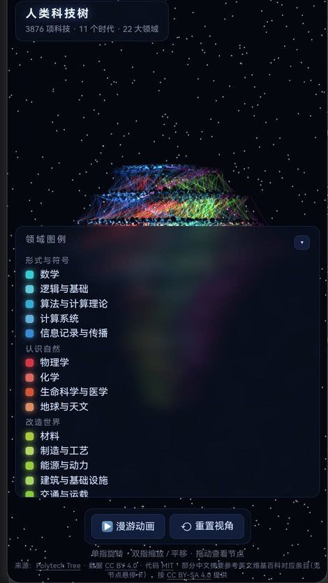

# polytech-tree-harmonyos · 人类科技树（鸿蒙应用）

把 [polytech-tree](https://github.com/secwind7/polytech-tree) 那座可以自由旋转的三维「科技之塔」，
封装成一个鸿蒙原生应用：桌面图标是一颗太空视角的地球，点开全屏进入 3876 项科技按时代分层、
按领域分扇区堆成的塔。



<p align="center">
  
</p>

## 这是什么

上游是一个纯前端项目（TypeScript + three.js + Vite），只能在浏览器里跑。
本项目把它变成可以直接装到鸿蒙设备上的应用，并补上了上游没有做的移动端适配。

与上游的差异集中在三块：

| | 上游 | 本项目 |
|---|---|---|
| 运行形态 | 浏览器网页 | 鸿蒙应用（ArkWeb 承载本地站点，无后端、无网络请求） |
| 页面加载 | `<script type="module">` + import map | **自包含单文件**（详见下文，`resource://` 下模块脚本会被 CORS 拦掉） |
| 窄屏 | 无适配，手机竖屏下面板全挤在一起 | 独立适配层：面板重排 + 取景补偿 + 触摸文案 |

## 仓库结构

```
polytech-tree-harmonyos/
├── app/                    鸿蒙应用工程（DevEco Studio 打开这个目录）
│   ├── AppScope/           应用级配置与分层图标（background + foreground）
│   ├── entry/
│   │   └── src/main/
│   │       ├── ets/        EntryAbility + ArkWeb 入口页
│   │       └── resources/rawfile/index.html   ← 打包进应用的自包含站点（构建产物，已提交）
│   └── build-profile.json5
├── site/                   站点源码（来自上游，含本项目的移动端适配）
│   ├── src/                TS 源码；mobile.css / mobile.ts 是本项目新增的适配层
│   ├── data/               科技数据（唯一事实源，来自上游）
│   └── index.html
├── tools/                  构建工具
│   ├── build.mjs           TS → dist（绕过 esbuild，纯 tsc）
│   ├── bundle_single.py    dist → 自包含单文件
│   ├── sync_to_app.sh      一键：编译 → 打包 → 同步进 rawfile → 工程自检
│   ├── validate_project.py 鸿蒙工程静态自检（不需编译器）
│   ├── devserver.py        带 no-store 的本地服务器（调试用）
│   └── appicon/make_icon.py 应用图标生成（PIL 逐像素渲染）
├── build/                  中间产物（gitignore）
├── BUILD.md                在 DevEco Studio 里编译安装的完整步骤
└── docs/                   README 配图
```

## 快速开始

需要 Node.js 18+、Python 3、PIL（仅图标生成需要）。

```bash
# 1. 装站点依赖（tsc 与 three 的类型）
cd site && npm install --ignore-scripts
#    注：--ignore-scripts 是为了跳过 esbuild 的 postinstall。
#    在 OpenHarmony 等没有 esbuild 预编译二进制的平台上，不加这个参数会直接失败。

# 2. 编译 + 打包 + 同步进应用 + 自检
sh tools/sync_to_app.sh
```

只想在浏览器里看站点（用于调试）：

```bash
node tools/build.mjs
python3 tools/devserver.py 5180          # 用 devserver 而不是 http.server
```

> `python -m http.server` 不发 `Cache-Control`，Chromium 会对它做启发式缓存，
> 改完 CSS 刷新页面仍然加载旧文件。`devserver.py` 补上了 `no-store`。

## 构建鸿蒙应用

用 DevEco Studio 打开 `app/` 目录，配好自动签名后点 Run。

完整步骤、SDK 版本约束、以及一份踩坑排查表见 **[BUILD.md](BUILD.md)**。
hap 产物在 `app/entry/build/default/outputs/default/`。

## 实现上值得说明的三点

### 1. 站点为什么必须打成单文件

ArkWeb 用 `$rawfile()` 加载页面时走 `resource://` 协议，**页面的 origin 是 `null`**。
而 Chromium 对 `<script type="module">` 一律按 CORS 模式去取脚本，
允许跨域的 scheme 白名单里没有 `resource://` —— 于是入口脚本直接被拒：

```
[web error] ERR_FAILED
[web] Access to script at 'resource://rawfile/src/main.js' from origin 'null'
      has been blocked by CORS policy
```

表现很迷惑：HTML/CSS 是静态的，所以界面外壳正常渲染，
只有 JS 一行没执行（统计行空、图例空、canvas 不存在），看起来像渲染 bug。

`tools/bundle_single.py` 把 three、OrbitControls、9 个应用模块和 3 个数据模块
全部拼进一个经典 `<script>`（自写极简模块表），HTML 与 CSS 一并内联。
产物零外部请求，CORS 无从触发。转换器带硬失败保护 —— 遇到没覆盖的
import/export 形式会直接报错退出，不会悄悄产出坏包。

### 2. 竖屏取景补偿

`startViewDistance()` 按塔的包围球推导视距，隐含「水平方向足够宽」这个前提。
但透视相机的垂直 fov 固定（55°），水平 fov = 2·atan(tan(vfov/2)·aspect)，
竖屏 aspect=0.46 时水平视野只剩宽屏的四分之一，塔会左右溢出。
现按宽屏基准反比放大视距（上限 1.85 倍）。

这个补偿放在 `startViewDistance()` **函数内部**，而不是调用处 ——
它是 `scene` / `controls` / `tour` 三处取景的共同入口，
而漫游收尾要求落点与 `resetView` 完全对齐，在外面乘系数会让三方距离失配、画面跳变。

### 3. 手机窄屏适配

上游 UI 全是 `position: fixed` + 写死尺寸、没有一条 media query。实测 390×844：

| 元素 | 适配前 | 适配后 |
| --- | --- | --- |
| 图例 | 208x812（高≈满屏，默认展开） | 104x48（折叠成按钮；展开时全宽限高覆盖层） |
| 标题 | 244x59（右半边被图例压住） | 190x50 |
| 工具栏 | 195x66（按钮文字折行） | 206x44 |
| 操作提示 | 「滚轮缩放 · 右键平移」 | 「单指旋转 · 双指缩放 / 平移 · 拖动查看节点」 |
| 面板重叠 | toolbar/hint/credit 三方互压 | 无 |

改动集中在独立一层：新增 `site/src/mobile.css`（全部媒体查询，不碰上游 `style.css` 一条规则）
与 `site/src/mobile.ts`，上游文件只动了 `layout.ts` 一个函数和 `main.ts` 两处调用。
窄屏阈值定在 640 CSS px，平板与折叠屏展开态维持原样。

## 许可与署名

本仓库的许可**分三部分**，都已在效。分发或再使用前请分别确认。

**1. 本项目的原创部分 —— MIT**（见 [LICENSE](LICENSE)）

`app/`（鸿蒙工程）、`tools/`（构建工具与图标生成），以及 `site/` 中本项目新增或修改的部分
（`src/mobile.css`、`src/mobile.ts`，以及 `src/layout.ts`、`src/main.ts` 中的改动）。

**2. 上游 polytech-tree 的代码与数据（位于 `site/`）**

其原始许可文件随目录一并保留，未作修改：

- `site/LICENSE` —— **MIT**，覆盖上游的代码（`src/`、`scripts/`）
- `site/LICENSE-data.md` —— 数据（`data/`）的**结构化字段**（year / era / category / kind /
  importance / dependencies）按 **CC BY 4.0** 提供；其中中文 `desc` 摘要含有源自英文维基百科的
  文本（翻译属衍生作品，而维基是相同方式共享），因此按 **CC BY-SA 4.0** 提供并署名，
  每条对应英文条目名见该条目的 `wikiEn` 字段。

**3. three.js —— MIT**

经 npm 引入；其源码被内联进 `app/entry/src/main/resources/rawfile/index.html`。

> 也就是说，那个单文件 HTML 是**混合许可**的产物：包含 MIT 代码（上游 + 本项目 + three.js）
> 与 CC BY 4.0 / CC BY-SA 4.0 数据。若要再分发它，需要同时满足这几项署名要求。

### 上游数据说明

上游在 README 中明确说明：整个数据集应视为**一个经过策展的教育索引，而非权威年表** ——
某项技术「首次出现」的年份本身就有争议，条目里的年份只是该次编纂所采用的选择。
本项目未对数据做任何改动。

## 上游

- [secwind7/polytech-tree](https://github.com/secwind7/polytech-tree) —— 三维科技树本体，
  数据、布局算法（圆柱塔分层 + 领域扇区 + 拥挤度扩散）、漫游排期与相机轨道均来自上游
- 本项目对 `site/` 的改动仅限移动端适配，未触碰布局与排期逻辑
